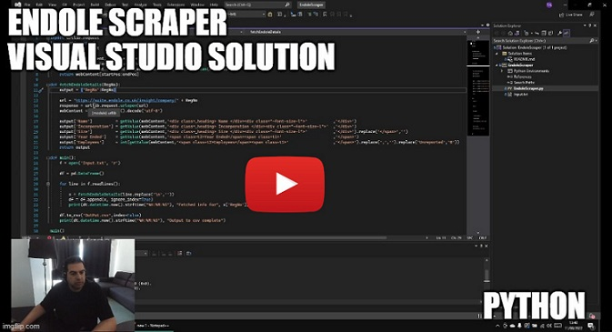
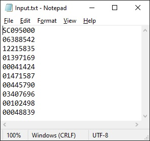
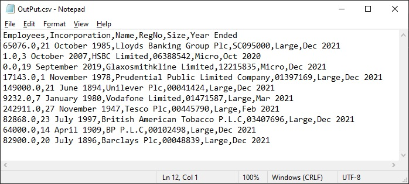

# Endole Web Scraper

A Python Web scraper that scrapes commpany research website Endole.co.uk.

Click below to watch the walkthrough video:

# Usage

In the project root directory `Input.txt` contains a list of Company Registration Numbers. Modify this file to include all the Reg numbers of the companies you wish to scrape data for.

The Python module reads this file and contructs URLs from these company registration numbers. Using `urllib.request`, the html files for each company is fetch and variable company attributes are added to a Pandas Dataframe.

Once the all details of all companies in the `Input.txt` file have been addded to the dataframe, the dataframe it written to a `Output.csv' as below.

